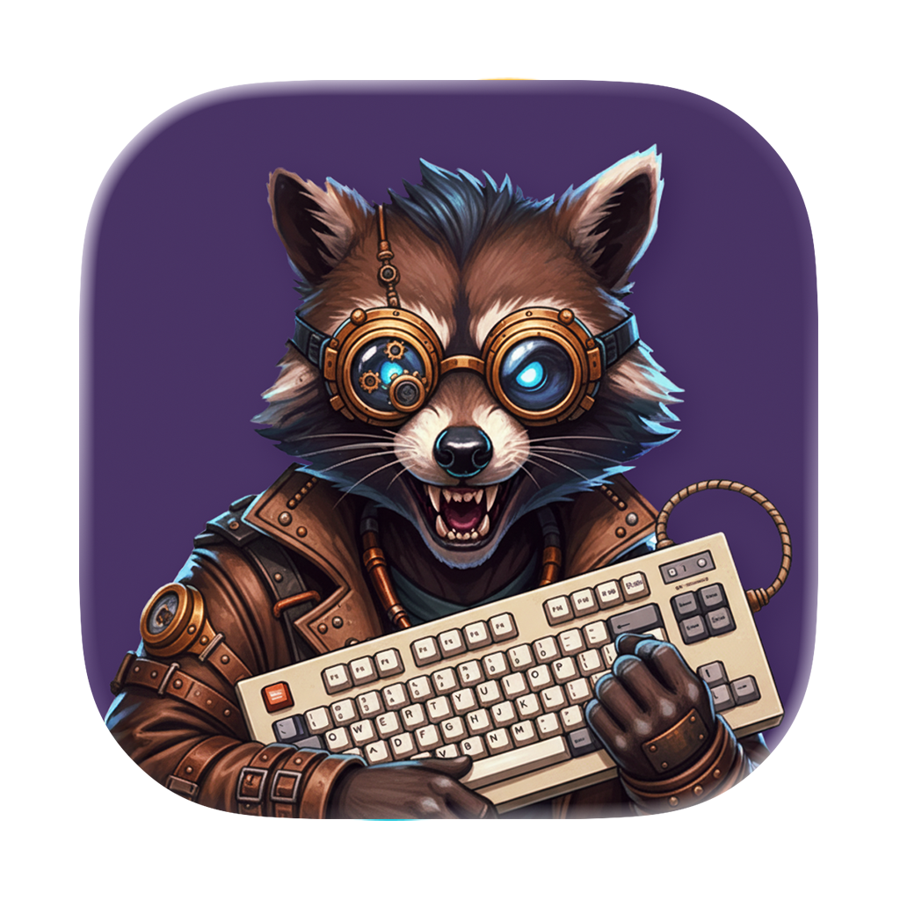

# Raccoon Toolbox 🦝

<div align="center" markdown="1">



</div>

**Work in progress**

A collection of developer utilities built with React and Tauri.

## Tools

- **Base64 encoder/decoder** — Encode and decode Base64 strings
- **Color converter** — Convert colors between different formats (hex, RGB, HSL, etc.)
- **HTML entity encoder/decoder** — Encode and decode HTML entities
- **JSON formatter** — Format and validate JSON data
- **Lorem Ipsum generator** — Generate random sentences and paragraphs of text in different languages
- **RegExp tester** — Test regular expressions against sample text
- **Text diff** — Compare two text blocks and see the differences
- **Text stats** — Number of characters, words, and so on in a text
- **Unicode lookup** — Look up Unicode characters
- **URL encoder/decoder** — Encode and decode URLs
- **URL parser** — Parse URL to its individual parts – host, path, query string, and so on

## Motivation

There are many similar apps already, such as [DevUtils](https://devutils.com/) or [DevToys](https://devtoys.app/) but they are often expensive, have poor UX or don’t have the tools I need. Also, I wanted to have a tool that I can use as a Mac app and a web app.

## Development

```bash
npm install
npm run dev
npm run dev:app
```

## Building

```bash
npm run build
npm run build:app
```
